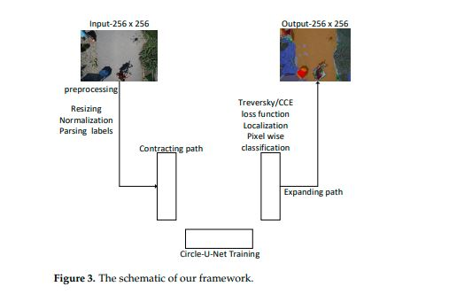

## Circle-U-Net 

This is implementation of Circle U Net for image segmentation

[Circle-U-Net: An Efficient Architecture for Semantic Segmentation](https://www.mdpi.com/1999-4893/14/6/159/htm) , published in Algorithms Journal 2021

**Dataset** : [ICG - TUGRAZ dataset](http://dronedataset.icg.tugraz.at)

**Installations**

    tensorflow-gpu==2.1.4

### Schematic Diagram



### Architecture


### Dataset Tree

```
---dataset
          |
          |---data--
                    |
                    |
                    |
                    |------icg_drone
                    |               |
                    |               |-----train_frames--
                    |               |                   |-----train------
                    |               |                   |                |001.jpg
                    |               |                   |                |002.jpg
                    |               |                   |                |003.jpg
                    |               |-----train_masks---
                    |               |                   |-----train------
                    |               |                   |                |001.jpg
                    |               |                   |                |002.jpg
                    |               |                   |                |003.jpg
                    |               |
                    |               |-----val_frames----
                    |               |                   |-----val--------
                    |               |                   |                |055.jpg
                    |               |                   |                |056.jpg
                    |               |                   |                |057.jpg
                    |               |-----val_masks-----
                    |               |                   |-----val--------
                    |               |                   |                |055.jpg
                    |               |                   |                |056.jpg
                    |               |                   |                |057.jpg
                    |
                    |---label_color.txt

```

In ICG semantic drone dataset ,

- "train_frames" could be taken from - semantic_drone_dataset_semantics_v1.1\semantic_drone_dataset\training_set\images

- "train_masks" could be taken from - 
semantic_drone_dataset_semantics_v1.1\semantic_drone_dataset\training_set\gt\semantic\label_images

Please randomly seperate train and val set as you like make sure there are 360 for training and 40 for testing

**Train frames**

all other images except in val set

**Train masks**

all other images except in val set

**Val frames** 

3,19,53,71,89,104,122,139,182,177,216,225,244,263,290,304,320,332,367,386
412,421,438,476,489,507,524,545,567,583,584,585,586,587,588,590,591,592,593,593,594


**Val masks** 

3,19,53,71,89,104,122,139,182,177,216,225,244,263,290,304,320,332,367,386
412,421,438,476,489,507,524,545,567,583,584,585,586,587,588,590,591,592,593,593,594


### Training

**Attenation Unet**


``` python drone_main.py -d "camvid_small" -idir "dataset/icg_drone/data/" -m "att_unet" -ht 256 -w 256 -bs 5 --loss tversky --num_epochs 60 ```


**Resnet101 Unet**

```python drone_main.py -d "camvid_small" -idir "dataset/icg_drone/data/" -m "res_unet" -ht 256 -w 256 -bs 5 --loss tversky --num_epochs 60 ```

**Unet**

```python drone_main.py -d "camvid_small" -idir "dataset/icg_drone/data/" -m "tiny_unet" -ht 256 -w 256 -bs 5 --loss tversky --num_epochs 60```

**Circlenet** - Tversky loss

```python drone_main.py -d "camvid_small" -idir "dataset/icg_drone/data/" -m "circlenet" -ht 256 -w 256 -bs 5 --loss tversky --num_epochs 60```

**Circlenet** - Categorical cross entropy

```python drone_main.py -d "camvid_small" -idir "dataset/icg_drone/data/" -m "circlenet" -ht 256 -w 256 -bs 5 --loss CCE --num_epochs 60```

**Circlenet with attention**  - Tversky loss

```python drone_main.py -d "camvid_small" -idir "dataset/icg_drone/data/" -m "circle_att_101" -ht 256 -w 256 -bs 5 --loss tversky --num_epochs 60 ```

**Circlenet with attention**  - Categorical cross entropy

```python drone_main.py -d "camvid_small" -idir "dataset/icg_drone/data/" -m "circle_att_101" -ht 256 -w 256 -bs 5 --loss CCE --num_epochs 60 ```

**Attention unet** - Categorical cross entropy

```python drone_main.py -d "camvid_small" -idir "dataset/icg_drone/data/" -m att_unet -ht 256 -w 256 -bs 5 --loss CCE --num_epochs 60 ```

**Resunet** - Categorical cross entropy

``` python drone_main.py -d "camvid_small" -idir "dataset/icg_drone/data/" -m "res_unet" -ht 256 -w 256 -bs 5 --loss CCE --num_epochs 60 ```

**Squeezeunet** -CCE 

``` python drone_main.py -d "camvid_small" -idir "dataset/icg_drone/data/" -m new_squeezenet  -ht 256 -w 256 -bs 5 --loss CCE --num_epochs 60 ```

**Evaluating model and predicting images**
    
    python evaluate.py -d "camvid" -idir "dataset/camvid/data/" -mt "squeeze_unet_keras" -m "camvid_model_5_epochs.h5" -ht 256 -w 256

    

### Related papers :

- [Growth of Unet](https://paperswithcode.com/method/u-net)
- [Unet - root](https://arxiv.org/pdf/1505.04597.pdf)

Last two years SOTA papers
- [UNet](https://arxiv.org/pdf/1505.04597.pdf)
- [UNet++](https://arxiv.org/pdf/1807.10165.pdf)
- [Att_UNet](https://arxiv.org/pdf/1804.03999.pdf)
- [ResUNet](https://arxiv.org/pdf/1512.03385.pdf)
- [RexUnet](https://arxiv.org/pdf/1611.05431.pdf)
- [Adversarial Learning](https://arxiv.org/pdf/1802.07934.pdf) 
- [NAS-Unet](https://ieeexplore.ieee.org/stamp/stamp.jsp?arnumber=8681706)


CVPR 
- [Eff-UNet](https://openaccess.thecvf.com/content_CVPRW_2020/papers/w22/Baheti_Eff-UNet_A_Novel_Architecture_for_Semantic_Segmentation_in_Unstructured_Environment_CVPRW_2020_paper.pdf)
- [Feedback U-net](https://openaccess.thecvf.com/content_CVPRW_2020/papers/w57/Shibuya_Feedback_U-Net_for_Cell_Image_Segmentation_CVPRW_2020_paper.pdf)
- [Enhanced rotation equivariant Unet](https://openaccess.thecvf.com/content_CVPRW_2019/papers/CVMI/Chidester_Enhanced_Rotation-Equivariant_U-Net_for_Nuclear_Segmentation_CVPRW_2019_paper.pdf)

ICCV 
- [Reccurent Unets](https://openaccess.thecvf.com/content_ICCV_2019/html/Wang_Recurrent_U-Net_for_Resource-Constrained_Segmentation_ICCV_2019_paper.html)
- [BCDU-Net](http://openaccess.thecvf.com/content_ICCVW_2019/papers/VRMI/Azad_Bi-Directional_ConvLSTM_U-Net_with_Densley_Connected_Convolutions_ICCVW_2019_paper.pdf) - https://github.com/rezazad68/BCDU-Net

- [GAN based_on UNet](https://openaccess.thecvf.com/content_CVPR_2020/papers/Schonfeld_A_U-Net_Based_Discriminator_for_Generative_Adversarial_Networks_CVPR_2020_paper.pdf)
- [RUNet for super resolution](https://openaccess.thecvf.com/content_CVPRW_2019/papers/WiCV/Hu_RUNet_A_Robust_UNet_Architecture_for_Image_Super-Resolution_CVPRW_2019_paper.pdf)


### Cite

Please site our paper if you use this code in your own work:

```
@inproceedings{fengsun2021circleunet,
  title={Circle-U-Net: An Efficient Architecture for Semantic Segmentation},
  author={Feng Sun, Ajith Kumar V, Guanci Yang, Ansi Zhang, Yiyun Zhang},
  booktitle={Algorithms},
  year={2021}
}
```

```
Sun F, Yang G, Zhang A, et al. Circle-U-Net: An Efficient Architecture for Semantic Segmentation[J]. Algorithms, 2021, 14(6): 159.
```